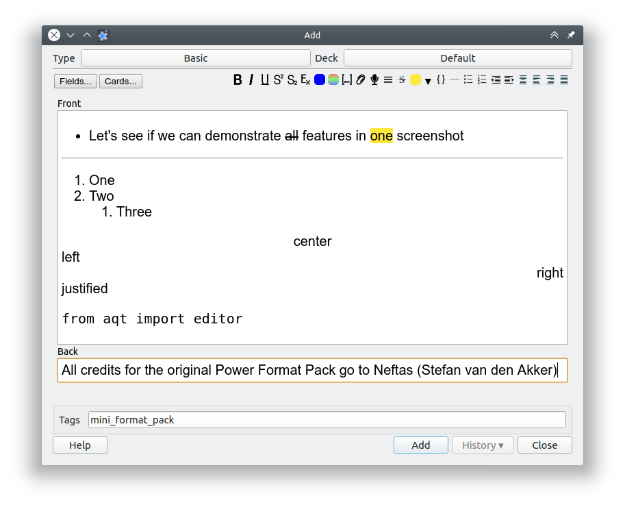

## Mini Format Pack Add-on for Anki

Extends the spaced-repetition flashcard app [Anki](https://apps.ankiweb.net/) with a number of additional text formatting options.

### Table of Contents

<!-- MarkdownTOC -->

- [Mini Format Pack Add-on for Anki](#mini-format-pack-add-on-for-anki)
    - [Table of Contents](#table-of-contents)
    - [Screenshots](#screenshots)
    - [Installation](#installation)
    - [Documentation](#documentation)
    - [License and Credits](#license-and-credits)

<!-- /MarkdownTOC -->

### Screenshots

### Installation

**AnkiWeb**

[Link to the add-on on AnkiWeb](https://ankiweb.net/shared/info/not_available_yet)

**Manual installation**

*Anki 2.1*

1. Go to *Tools* → *Add-ons* → *Open add-ons folder*
2. See if the `mini_format_pack` folder already exists
3. If you would like to keep your settings thus far: Find the `meta.json` file contained within and copy it to a safe location.
4. Proceed to delete the `mini_format_pack` folder
5. Download and extract the latest Anki 2.1 add-on release from the [releases tab](https://github.com/Glutanimate/mini-format-pack/releases)
6. Rename the extracted folder to `mini_format_pack` and move it into the add-ons directory
7. Optional: Place the `meta.json` file back in the directory if you created a copy beforehand.
8. Restart Anki

### Documentation

For further information on the use of this add-on please check out [the original add-on description](docs/description.md).

### License and Credits

*Mini Format Pack* is:

*Copyright(c) 2014-2018 [Stefan van den Akker](https://relentlesscoding.com/)*

*Copyright(c) 2017-2018 [Damien Elmes](http://ichi2.net/contact.html)*

*Copyright (c) 2018 [Glutanimate](https://glutanimate.com/)*

*Mini Format pack* is based on [*Power Format Pack*](https://github.com/Neftas/supplementary-buttons-anki) by [Stefan van den Akker](https://github.com/Neftas). All credit for the original idea and implementation goes to him. I would like to express my heartfelt gratitude for all of what he has done for the Anki community over the years. PFP was one of the projects that originally inspired me to go into add-on development. Thank you for that, Stefan!

Licensed under the [GNU AGPLv3](https://www.gnu.org/licenses/agpl.html). The code for this add-on is available on [ GitHub](https://github.com/glutanimate/mini-format-pack).

Licensed under the [GNU AGPLv3](https://www.gnu.org/licenses/agpl.html).